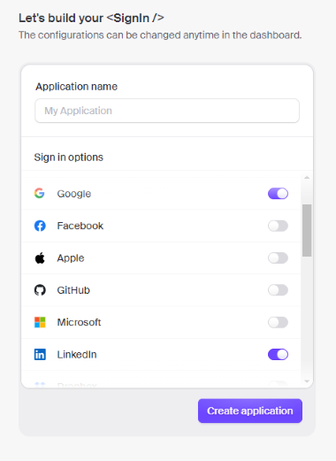
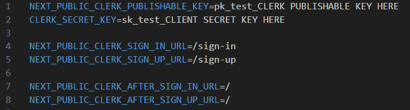
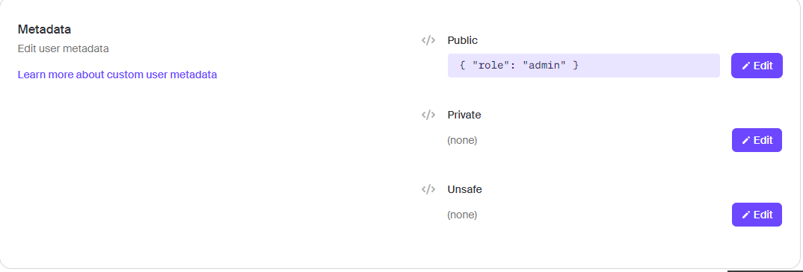
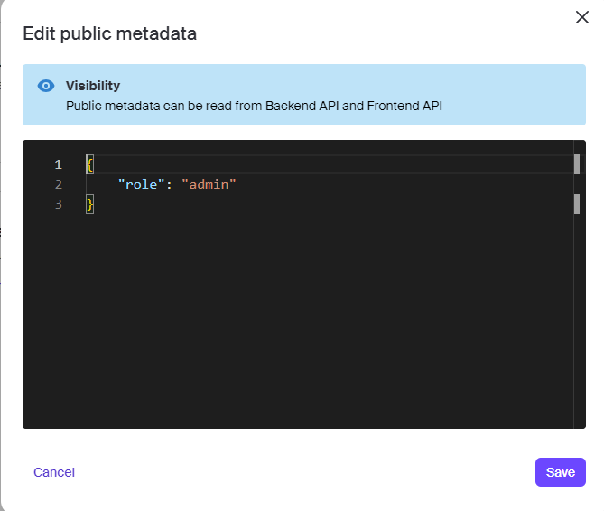
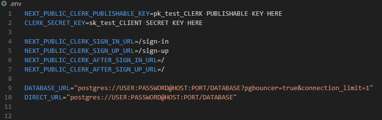

# Setup

## Clone Github Repository

Run the following command in the CLI to clone down the repository

```bash
git clone https://github.com/NTIG-Uppsala/Stuns-Aterbrukslabbet.git
```

## Download Node.js and necessary packages

Download Node.js at this [link](https://nodejs.org/en/download)

For this project we use Node.js version 20.11.0

Run the following command in the CLI to get the necessary packages from the node package manager.

```bash
npm install
```

## Set up Clerk authentication

### Creating a clerk application

- Go to the [clerk website]("https://clerk.com/") and create an account and a clerk application if you do not already have one you wish to use.

- When creating a clerk application you will need to choose which sign in options that can be used to access your application. This project uses Google, Linkedin and email. Other connections won't be tested and aren't guaranteed to work. This option can be changed later in the User & Authentication tab in the clerk dashboard.



### Setting up the .env file

- First, go to the API Keys tab in the clerk dashboard to find your NEXT_PUBLIC_CLERK_PUBLISHABLE_KEY and CLERK_SECRET_KEY and copy them.

- Then, create a `.env` file in the root folder of your project and paste the copied keys followed by the code below into your newly created `.env` file.

```
NEXT_PUBLIC_CLERK_SIGN_IN_URL=/sign-in
NEXT_PUBLIC_CLERK_SIGN_UP_URL=/sign-up

NEXT_PUBLIC_CLERK_AFTER_SIGN_IN_URL=/
NEXT_PUBLIC_CLERK_AFTER_SIGN_UP_URL=/
```

Your `.env` file should now look like this.



### How to create an admin account

On the website there exists an admin dashboard that is only accessible to users with the admin or moderator role. Admins can, through the admin dashboard, delete and change the roles of non admin users. Moderators do not have the ability to effect the roles of other users but are able to delete accounts belonging to users who don't have the admin or the moderator role. Admins and moderators are also able to delete posts on the website.

- Go to the users tab in the clerk dashboard and click on the user you would like to set as admin.

- Scroll down to the metadata settings and edit the public metadata of the user you want to set as admin.



- Give the user the role admin as seen in the image below and click on save. That user should now be able to access the admin dashboard on the website.



## Set up database with prisma

- Create a PostgreSQL database of your choosing and get the database url and the direct url from that database.
  [Documentation on database connection strings](https://www.prisma.io/docs/orm/overview/databases/postgresql#connection-details)

> If you use Supabase as your database the transaction url is equivalent to the database url and the session url is equivalent to the direct url

- Paste the database url and the direct url into the `.env` file in the root of your project. Your `.env` file should now look like this.



- Run this command to generate the database in prisma

```bash
npx prisma generate
```

- Run this command to push the database you generated in prisma to your PostgreSQL database

```bash
npx prisma db push
```

If you make changes to the `schema.prisma` file in the prisma folder in the root of the project, run the following commands to migrate the database changes.

```bash
npx prisma generate
```

```bash
npx prisma migrate dev
```

## Set up webhooks

This application uses webhooks to assign the member role on account creation.

### Set up endpoint

- Go to webhooks on your clerk dashboard, then press add Endpoint.

- The endpoint URL should be your url + /api/webhooks for example https://stuns.ntig.dev/api/webhooks.

- On filter events, user.created and session.created should be picked.

### Set up .env file

- From your clerk endpoint copy the signing secret

- In your `.env` file create a key named WEBHOOK_SECRET and paste the signing secret as its value

```bash
WEBHOOK_SECRET="Signing secret here"
```

## Set up emails

This application uses resend to send emails.

### Setup Resend
